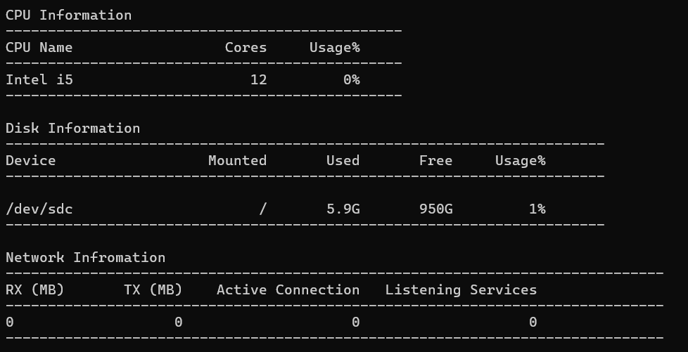

# Bash System Monitoring

A bash script that displays your systems cpu, disk, and network information in a table style. Here is a screenshot of how the table will look like,

# Commands:

- q - quit the script.

# Current Features:

1. Displays cpu, disk, and network information on a terminal in a table style. $\textbf{The cpu usage doesn't reflect the built in systems task manager or any similar programs}$.

2. Updates only the cpu usage value in it's specific column $\textit{only}$ when the terminal window size is in full screen.

3. Coded entirely in bash.

# Future Features:

1. Updates the cpu ussage value and any other values that can be updated will be done in it's own colum and row, even when the terminal window has been resized.

2. Create a status column for the cpu information and networking information to see if the cpu and network works properly and either display "Good" or "Bad" in green and red respectively.

3. Update the design of the table to have a box surrounding the data to make it look polished.

# Problems:

1. The cpu usage doesn't update in it's column and row when resizing the terminal window. It only udpates when the terminal window is the full size.

2. The cursor doesn't properly go back to the original position to type in "q" to quit the script.

3. Don't have a way to see how many rows and columns does the fixed table take up in the terminal to dynamically get the location of values that can get updated in "real time".

# Credit

Lead Developer - Prayag Patel
